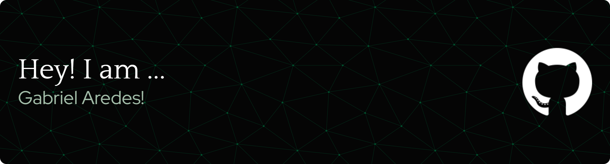

  
 

 

  
Que tal desenvolvermos soluções práticas em projetos reais juntos? 🚀

-----

<h2>🔊​​ Me contate!</h2>
 

  <!-- GitHub -->
  

  <!-- LinkedIn -->
  

  <!-- Gmail -->
  

  <!-- WhatsApp -->
  

  <!-- Instagram -->
  

 
 

-----

<h2>- ⌨︎' Linguagens e Ferramentas</h2>
 

  <!-- C -->
  

  <!-- C++ -->
  

  <!-- Java -->
  

  <!-- Spring -->
  
 
 
  <!-- HTML5 -->
  

  <!-- CSS3 -->
  

  <!-- React -->
  

  <!-- JavaScript -->
  

  <!-- Node.js -->
  
 
 
  <!-- AWS -->
  

  <!-- SQL -->
  

-----

  <i>
     
     
    <b>Seja muito bem-vindo</b> :wave:!  
    Me chamo <code>Gabriel Aredes</code>, tenho 18 anos e sou 
    <code>estudante</code> de Engenharia de Software (🖥️) na 
    <a href="https://www.pucminas.br/" target="_blank">PUC Minas</a>.  
    Constantemente buscando transformar aprendizado em <code>prática</code>, 
    convido-o a dar uma olhada no meu portfólio (link futuro)!
  </i>

 

-----

🍀 - Meus interesses pessoais:

<table>
<tr>
 <td align="center" colspan="2"></td>
</tr> 
<tr>
<td width="500px" >

 
- 𖣘' Na <a href="https://www.pucminas.br/" target="_blank">PUC Minas</a>, sou <code>estudante</code> no curso de Engenharia de Software. Sempre me interessei por tecnologia, e sempre procuro me <code>aprimorar</code>, buscando aprendizado contínuo, em concomitância com a prática, para sempre manter a absorção dos conteúdos; 
- 𖣘' No tempo livre, sou aficionado na cultura nerd (quanto mais cultura melhor, amigos), principalmente quando o assunto se trata dos meus universos favoritos <code>Star Wars</code> e qualquer conteúdo relacionado a <code>The Last of Us;</code> 
- 𖣘' Sou apaixonado por jogos, principalmente os de história. Já falei de <code>The Last of Us</code>? Pois é, o melhor jogo já criado, e não está aberto a debates. Além disso, <code>Red Dead Redemption 2</code> e <code>Alan Wake</code> tem um espaço guardado no meu coração. Joguem.

- 𖣘' O que falar de <code>Astronomia</code>? Sou apaixonado pelos cosmos, e com certeza é uma área que eu adoro me aprofundar, por puro hobby. Sempre gostei do tema e quantos mistérios o universo tem, em tantos bilhões de anos luz de distância. Inclusive, vale a pena falar que o melhor filme criado na história é astronômico. Sim, estou falando de <code>Interestelar</code> 

</td>
<td>

</td>
</tr>
<tr>
 <td align="center" colspan="2"></td>
</tr> 
</table>

-----

GitHub Stats:

<table>
<tr>
 <td align="center" colspan="3"></td>
</tr> 
<tr>
<td>

</td>
<td>

</td>
<td>

</td>
</tr>
<tr>
 <td align="center" colspan="3"></td>
</tr> 
</table>
<table>
<tr>
 <td align="center">:watch: <a href="https://wakatime.com/@Gabriel_Aredes">WakaTime</a></td>
</tr>
<tr>
<td>

</td>
</tr>
</table>
<table>
<tr>
 <td align="center" colspan="3"></td>
</tr> 
<tr>
<td>

</td>
<td>

</td>
<td>

</td>
</tr>
<tr>
 <td align="center" colspan="3"></td>
</tr> 
<tr>
<td>

</td>
<td>

</td>
<td>

</td>
</tr>
<tr>
 <td align="center" colspan="3"></td>
</tr>
</table>

<table>
<tr>
 <td align="center"></td>
</tr>
<tr>
 <td align="center"></td>
</tr>
<tr>
 <td align="center"></td>
</tr> 
</table>

-----

 Aredes's Spotify Data

</a>

<table>
<tr>
 <td align="center" colspan="3"></td>
</tr> 
<tr>
<td>

</td>
<td>

</td>
<td>
<!--  -->

</td>
</tr>
<tr>
 <td align="center" colspan="3"></td>
</tr> 
</table>

-----

